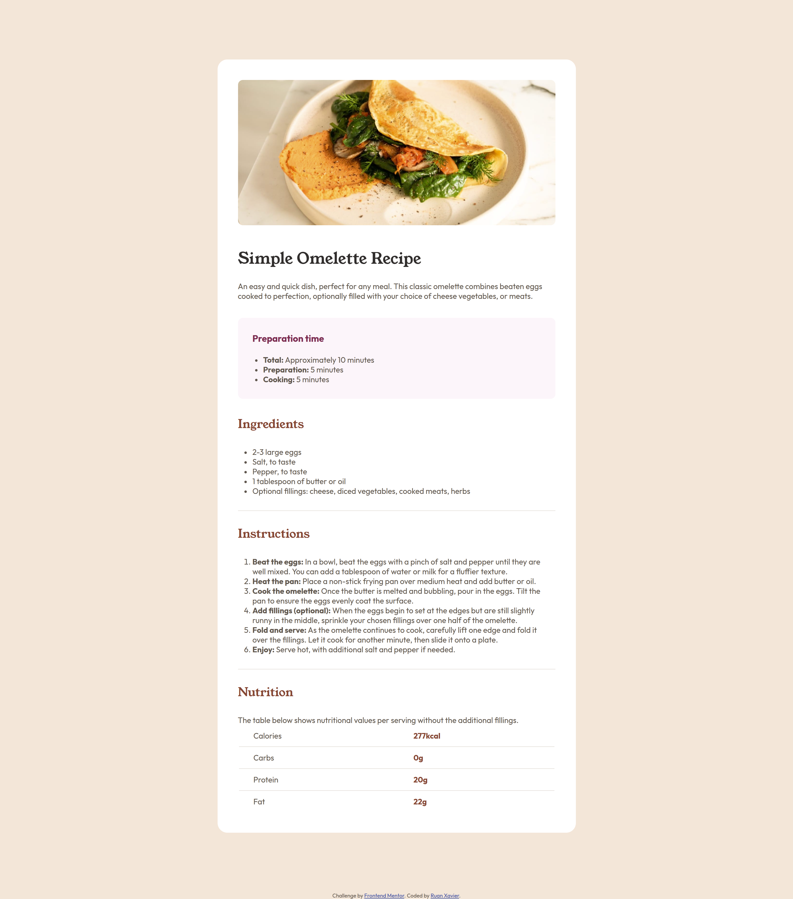
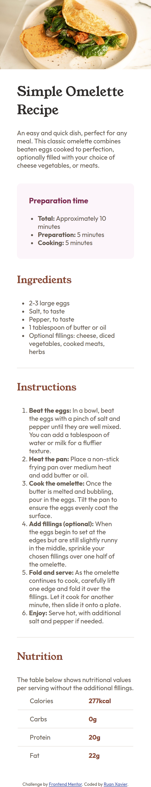

# Frontend Mentor - Recipe Page

Esta é uma solução para o [desafio da página de receita no Frontend Mentor](https://www.frontendmentor.io/challenges/recipe-page-KiTsR8QQKm).

## Visão Geral

### O Desafio

O objetivo é criar uma página simples de receita, que inclui uma imagem de prato, uma descrição, o tempo de preparo, os ingredientes, as instruções de preparo e os valores nutricionais.

### Captura de Tela

  

### Links

- URL da solução: [https://github.com/ruan-xavier/Recipe-page](https://github.com/ruan-xavier/recipe-page)
- URL do site ao vivo: [https://pagina-de-receita.netlify.app/](https://pagina-de-receita.netlify.app/)

## Meu Processo

### Construído Com

- HTML5
- CSS (Customizado com Flexbox)
- Google Fonts

### O Que Aprendi

Aprendi a criar uma página responsiva usando `flexbox`, além de como estruturar e estilizar uma página de receita com uma boa hierarquia visual e um design limpo.

## Autor

- Frontend Mentor - [@ruan-xavier](https://www.frontendmentor.io/profile/ruan-xavier)
- GitHub - [ruan-xavier](https://github.com/ruan-xavier)
- YouTube - [@RuanHenriqueXavier](https://www.youtube.com/@RuanHenriqueXavier)
